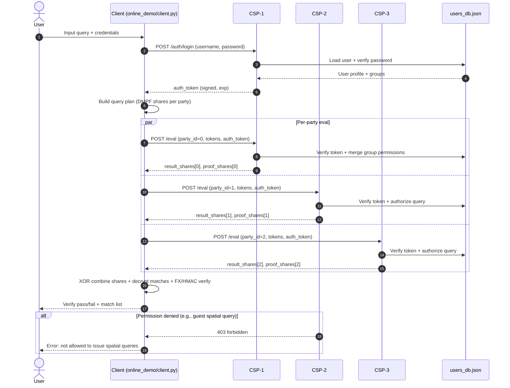

# Online Demo (Client + CSPs + Initial User RBAC)

## 1) Build index artifacts
```bash
python online_demo/owner_setup.py
```
This produces `online_demo/aui.pkl` and `online_demo/K.pkl`.

## 2) Quick run with auth-enabled defaults
```bash
python online_demo/run_all.py "ORLANDO; R: 28.3,-81.5,28.7,-81.2"
```
`run_all.py` starts 3 CSP nodes (`8001/8002/8003`) and runs the client with default user `alice/alice123`.

## 3) Run as a different user/group
```bash
python online_demo/run_all.py --username bob --password bob123 "ORLANDO"
```

## 3.1) Expansion + priority ranking
`online_demo/client.py` now supports platform-style ranking on top of expansion recall:
```bash
python online_demo/client.py \
  --query "ORLANDO UNIVERSITY; R: 28.2,-81.6,28.8,-81.1" \
  --expansion-mode fallback \
  --top-k 20
```
Optional expansion backends:
- `--expansion-mode none` : only base query.
- `--expansion-mode fallback` : local synonym expansion.
- `--expansion-mode gemini` : Gemini expansion (falls back automatically if unavailable).

Priority score is a weighted sum of:
- base-query hit bonus (`base_query_hit=80`)
- expansion-subquery hit bonus (`expansion_query_hit=22`)
- exact token match in `NAME`/`ADDRESS,CITY,STATE`
- synonym token match in `NAME`/`ADDRESS,CITY,STATE`
- exact/synonym token coverage
- ordered phrase bonus in `NAME`
- spatial range bonus when coordinates are inside query `R:`.

## 4) New local simulation for group-based communication
```bash
python online_demo/simulate_group_queries.py
```
This script:
- starts local CSP servers,
- logs in as `admin`,
- creates a new group and user online (`power_user` / `charlie`),
- runs cross-group query checks (allowed and denied scenarios).

## Optional C++ acceleration (same project layout)
Build the optional native module in-place:
```bash
python setup_native_accel.py build_ext --inplace --compiler=mingw32
```
If the native module is not built, the system automatically falls back to pure Python.

## Default demo accounts
- `admin / admin123` (can manage users and groups)
- `alice / alice123` (analyst group, spatial query allowed)
- `bob / bob123` (guest group, spatial query denied)

## Server endpoints (initial implementation)
- `POST /auth/login` - username/password login, returns signed `auth_token`.
- `POST /auth/whoami` - get user profile from token.
- `POST /admin/create_group` - upsert group policy (`can_manage_groups` required).
- `POST /admin/create_user` - upsert user (`can_manage_users` required).
- `POST /admin/assign_groups` - update user groups (`can_manage_users` required).
- `POST /admin/list_users` - list users (`can_manage_users` required).
- `POST /admin/list_groups` - list groups (`can_manage_groups` required).
- `POST /eval` - secure search execution, now requires `auth_token`.

## Internal layout note
- `online_demo/runtime_utils.py` centralizes shared HTTP/login/CSP-process helpers.
- `client.py`, `run_all.py`, and `simulate_group_queries.py` reuse this module to reduce duplicated path/network code.

## Request sequence diagram


## Group permission model (demo version)
Each group can define:
- `can_search`
- `allow_spatial`
- `max_keywords`
- `can_manage_users`
- `can_manage_groups`

Request authorization is checked in `/eval` before CSP share computation.
